# Pyber Ride-Sharing App Analysis

## Overview

#### Initial approach

Pyber, a Python-based data-sharing app, has approached us for a data analysis assignement. Using data from multiple .csv files, we will need to explore information that the app has collected about its drivers, the cities where the app is usage, the rides that have happened in each area, and the fares that have been charged in each location, at different dates and times of year.

Our analysis will help Pyber evaluate the scale of effectiveness of their ride-sharing app. Using the knowledge that will be produced by our analysis, Pyber hopes to be able to provide access to its ride-sharing on a larger scope. We will be evaluating information that has been collected on various cities, and we will try to determine the affordability of rides for parts of the country that are not yet served by Pyber.

#### Programmatic Execution

Using Python language on Jupiter Notebook - part of the Anaconda package - we used Pandas, NumPy and Matplotlib dependencies to read, merge, inspect, clean, sort, calculate and visualize data from the .csv datasets that were provided; and to create powerful visualizations that have aided us in conveying our analysis.

#### Final Project

As our final project, we created two visual plots:

1. A summary DataFrame that outlines the ride-sharing data by city type - our dataset grouped the cities in these three basic categories: Rural, Suburban and Urban cities. This DataFrame helps us understand the following about each category of cities:

   - Total of rides executed during the time-period that the data was collected.
   - Total of drivers that were working for Pyber during the time-period that the data was collected.
   - Total value of the fares that were paid in the cities of that specific category during the time-period that the data was collected.
   - The average fare paid per ride.
   - The average fare earned per driver.

2. A line graph that shows three lines - one per each category of city. We zoomed our focus into a selection of weeks, and we examined the fares that were collected during each week at each of the categories of cities. By regarding this multiple-line graph, we can help Pyber make inferences about the types of cities, and aid Pyber in their decision-making process toward expansion going forward.

   

## Results

#### Summary DataFrame

##### Merging Two DataFrames

Our **Summary** **DataFrame** was built using **two** separate .csv **datasets**, which we loaded and read using Pandas and Jupyter Notebooks: 

- **city_data_df** - A DataFrame that contained information about the cities in which the Pyber was used, the driver count in those respective cities, and the category of each of these cities - Rural, Suburban or Urban.
- **ride_data_df** - A DataFrame that contained information about individual rides that were executed in the cities where Pyber was used. This is the information this DataFrame provided about each ride: 
  - City of ride 
  - Date of ride
  - Ride ID
  - Fare that was charged

Below are the two separate datasets, as two separate DataFrames, as shown as we read each one of them in Jupyter Notebooks:

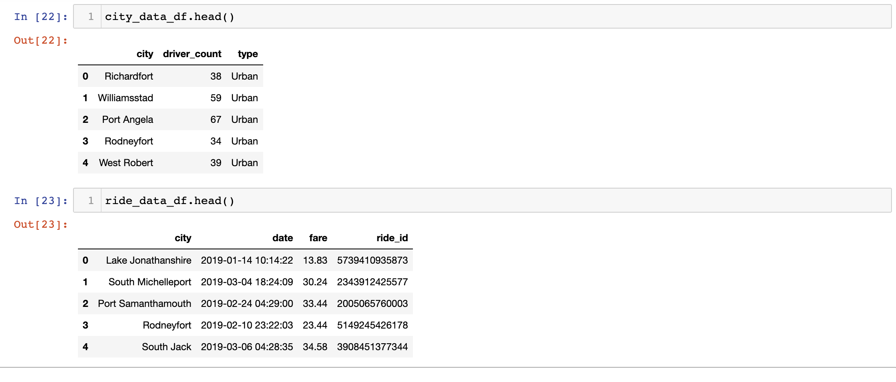

In order to provide a wider scope of analysis, we **merged** datasets using the default inner-merge approach, using the 'city' column - a common column amongst both datasets.

Now, our new DataFrame, **pyber_data_df**, is comprised of columns from  city_data_df and ride_data_df, where 'city', the common column, is the first one that appears. We determined that information about the specific rides would precede the information about the cities, so we established that ride_data_df would be placed on the left, as seen on this screenshot of our Jupyter Notebook file:

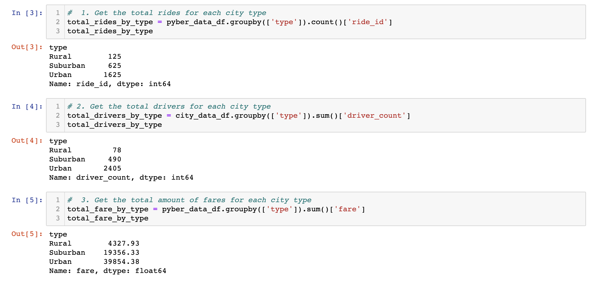

##### Building the Summary DataFrame

In order to build our Summary DataFrame, we used the *.groupby()* function in Pandas to create specific DataSeries indexed by the types of cities. We created initially three Data Series:

- Total Rides by city type
- Total Drivers by city type
- Total Fare by city type

These three DataSeries will represent the first three columns of our new Summary DataFrame, and they will be populated by the count or sum of each respective column where the information that we are looking for is contained - extracted from the merged pyber_data_df DataFrame; or, in the particular case of the 'driver count' column, we populated it with data the original city_data_df, where the driver count was linked only to the cities, and not to any ride dates.

This is a screenshot of this first step of our process:

For the next part, we created two new DataSeries  that will hold the information contained in the last two columns of the new Summary DataFrame. Those columns will be:

- Average Fare per Ride
- Average Fare per Driver

In order to get those numbers, we divided the total total values of fares by the total of rides and drivers, respectively, all of which were DataSeries we already  had from the previous step, with city type as the index. So, we used those DataSeries to create these two new DataSeries, as seen below:

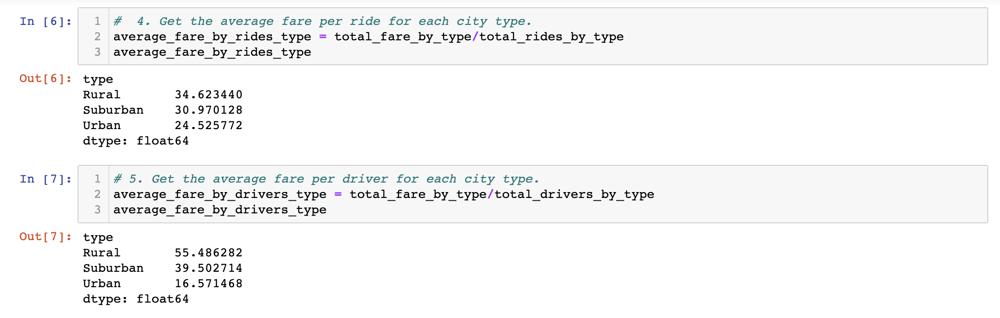

These were our subsequent steps:

- Created the data for the **Summary DataFrame** using our DataSeries, establishing the key-value pairing that will populate the columns of the DataFrame.
- Built the new DataFrame.
- Printed the Summary DataFrame.

When printed, the new DataFrame showed the heading 'type' over the three different city types that we have as indexes. Visually, we wanted to get rid of that, so we cleaned it up by using the *index.name* function and setting it to 'None'.

This screenshot shows our steps:

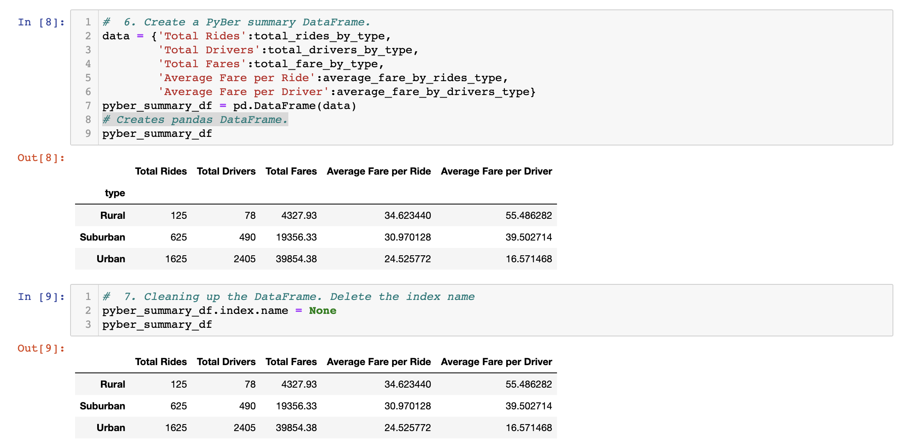

Lastly, we formatted our DataFrame columns to reflect a visual format that corresponds to the information in each one:

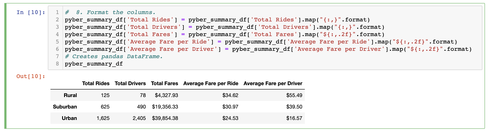
https://github.com/anaorenstein/PyBer_Analysis/blob/f5bc8e7f04225e8130083ecd678ef46330ae09e2/Challenge_Images/Pyber_challenge_D1%238.png

The final **Summary DataFrame** is ready for visualization!

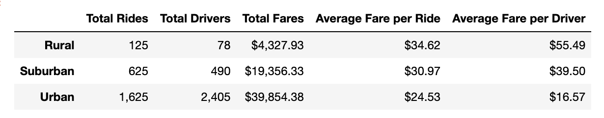

##### Interpreting the Summary DataFrame

Average fares per ride are the highest in the rural areas , lowest in the urban areas. But when looking at the average fare per driver, the discrepancy between rural and urban areas increases even more - the rural average per driver in numbers is significantly higher than the average fare per driver in the urban areas. Drivers in the rural cities currently make more money per ride than their urban peers do. 

In urban areas, however, PyBer has a lot more reach - the total number of drivers in rural areas is drastically smaller. There are thirty times less drivers linked to the ride-sharing app in the rural cities that were surveyed than there are in the urban cities. The dollar amount of total fares is still only ten times larger in the urban area, which aligns with the disparity that we observed in average fare per driver.

In the total number of rides there is a discrepancy between the two - rural and urban - that paints a similar picture to the total fares - there are only ten times more rides happening in the urban cities than in the rural cities.

By comparing these two extremes, we get a sense that people in rural areas might be needing to use the service, but there may not be enough drivers available. Seems like there is potential for expansion in cities in that area by recruiting more drivers and adjusting the fares to attract more customers.

In the urban cities, even though fares are lower, and there are a lot of drivers available, more can be done to make PyBer more competitive still for customers who are picking this service versus other ride-sharing services which are more likely to exist in larger numbers in those cities.

The numbers in the suburban areas present a more even spread. The discrepancy between the dollar amounts of the average fare per ride and average fare per driver is smaller than in the other areas. The difference between total rides and total drivers are also the smallest of all three groups. The dollar amount of total fares shows a lucrative return.  PyBer seems to be represented solidly in those areas, and the equilibrium indicates potential for Pyber's future growth to continue in a steady, reliable rate.  

#### Summary Line Chart

##### Reading and manipulating the Merged DataFrame

We read the merged DataFrame, pyber_data_df, and we used the *.groupby()* function on two columns, 'type' and 'date', and chained that to a *.sum()* function applied on the 'fare' column. 

This gave us **two indices** for grouping together the information, or data, about  fares - the **type** of city where the ride happened (Rural, Suburban or Urban), and the **date** when the ride happened, creating a new DataFrame, fare_types_by_date_df:

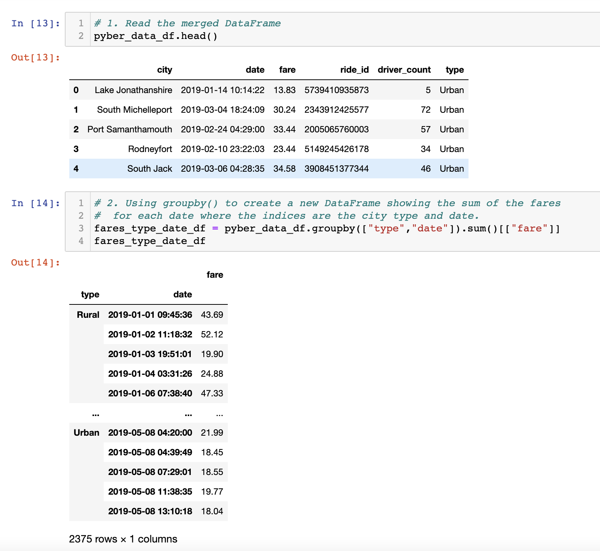

Next, we **reset** the index to [0-2374] to provide for content for each cell to be placed according to its corresponding category under the column heading to which it pertained:

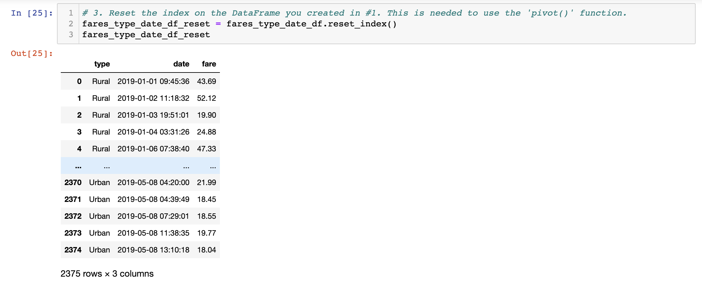

By doing that, we also had a format that was appropriate for creating a **pivot table** using the *.pivot()* function and setting the 'date' as index, 'type' as columns, and 'fare' as values:

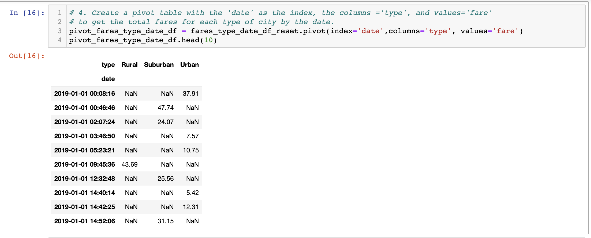

Next, we applied the *.loc[]* function to create a new DataFrame using the pivot table, zooming the focus on a **specific time period** - January 01 through April 29th of 2019 - for our analysis. We also inspected the datatypes and content of that new DataFrame by applying the *.info()* function:

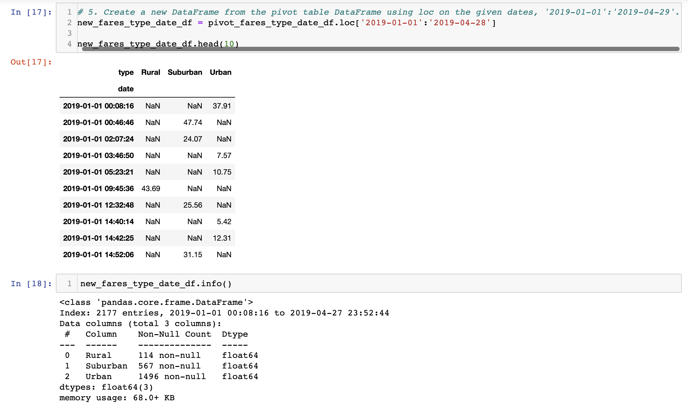

Seeing that our index datatype showed as regular *Index* in the previous version, we set the 'date' index of our DataFrame to a *datetime* datatype. Now, upon inspecting the datatypes, we can see that Index is now set to *DatetimeIndex*:

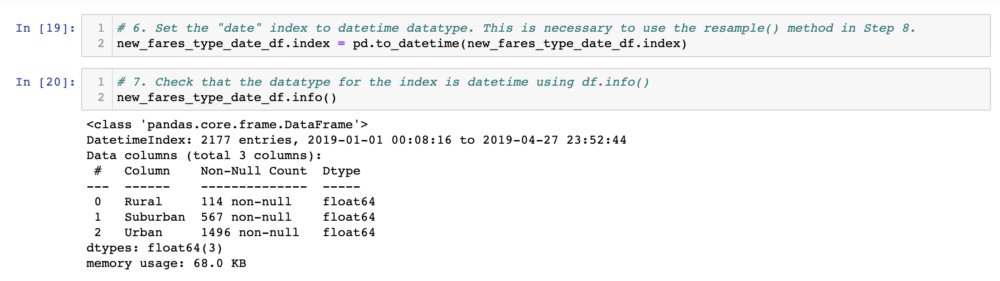

To finalize the construction of our DataFrame, we **resampled** it using the *.resample()* function. We did our resampling by week, and we specified that we wanted to see the sum of the fares for each week. 

This is our final DataFrame, indexed with datetime indexes for each week, and showing three columns - Rural, Suburban and Urban - with the sum of the fares for each of the weeks in each of the areas, or 'types' of cities. The final **weekly_fares_df** DataFrame looked like this:

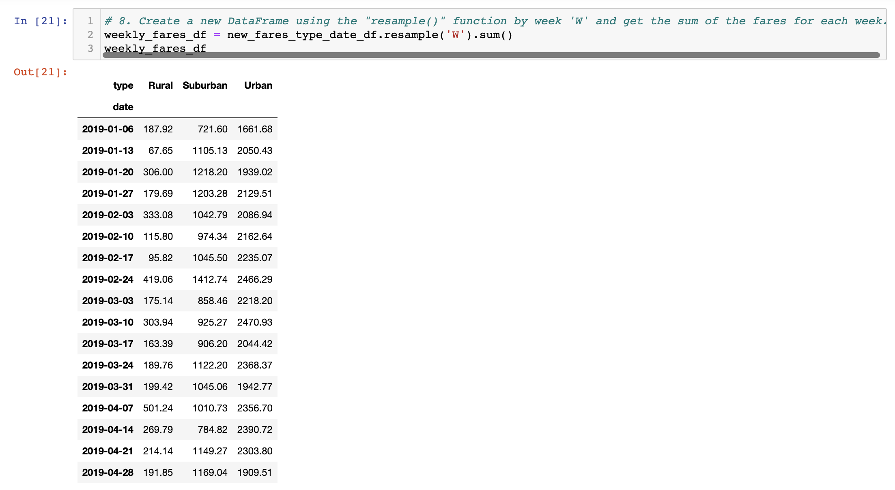

##### Plotting a multi-line chart

Using the object-oriented interface method with Matplotlib on Jupyter Notebook, we plotted the weekly_fares_df DataFrame into a multi-line chart. Using the graph style 'fivethirtyeight', the chart looks appealing, the information is clear:

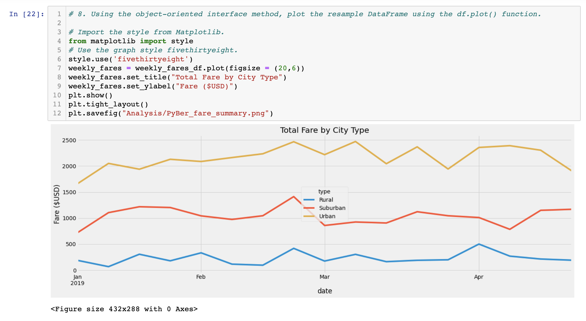

We can now base our data analysis on the **Summary Line Chart**!

##### Interpreting the Summary Line Chart

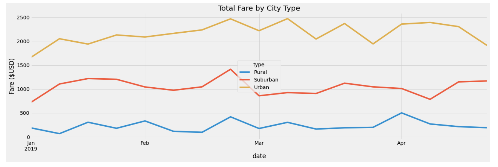

The Summary Line Chart allows us to use a snippet of the dataset in order to veer our analysis to visualization and interpretation of the relationship between the three types of cities and the total fares per week, over a period of four months.

- For the Urban cities, the fares seem to reach their peaks around end of February and beginning of March, following a decline in mid-March that oscillates pretty starkly, until they reach another peak at the beginning of April. Throughout the month of April, the fares keep at a higher value until they decline. By end of April, the fares tend to the starting lower point where they were in the beginning of January.

- For the Suburban cities, fares start at a lower point in January, and then ride consistently until a stark peak by the end of February. There is a visible decline in the beginning of March, and then a steady rate until a peak at mid-April, which is sustained through its end. The values are higher at the end than the initial January values.

- For Rural cities, the oscillation were not as drastic, though there is also here a peak at mid-February and a decline at the beginning of March. There is another peak in the beginning of April, and a slightly declining tendency from then. The starting values are about the same as the ending ones.

The value brackets that each line corresponding to each type of city occupies does not overlap with all others. Each city type has its characteristics, and the maximum and minimum values for each type are sort of stacked up against one another - Urban, Suburban and Rural, in this order. There is a common trend of sudden rise and sudden decline in mid-to-end of February and beginning of March. Considering that this is happening in the year 2019 this may have to do with the onset of the global Covid-19 pandemic.

As observed in the previous interpretation, of the *Summary DataFrame*, this Summary Line Chart also reveals more particularly concerning, or indicative of potential for change and growth, in characteristics of the Urban and Suburban type cities:

- There are specific oscillations in the Urban city type, and the decline that happens at the end of April may indicate a probability that the total fares are going to continue to decline from there. 
- The Rural city type shows a pretty regular trend, but the total values are too low.

### Summary

Based on the results and the interpretations we have made, we can provide three business recommendations for the CEO of PyBer to address the need for adaptations to their business model. In each city type, we believe that some adjustments can be made to promote ongoing success for PyBer.

1. For the **Urban** city type, we suggest a campaign to promote the PyBer brand for its customer and to help it stand out amongst its competing ride-sharing companies and amplify its costumer base. There may be more ways that PyBer can stand out, such as providing a perk like joint promotions with restaurants, or other conveniences. Ensuring distribution of drivers amongst the different neighborhoods can also be a benefit as the rides could be fetched quicker than the rest. Another way to make PyBer stand out could be making guidelines that might provide a safer ride in times of the pandemic in the big city.

2. For the **Suburban** city type, since the numbers seem particularly balanced, it would be wise to ensure that the business model remains consistent. In order to envision more for the future and to promote the continued growth of PyBer in the suburbs, one idea would be to create new business models within  the business model, such as food delivery, grocery delivery, and specific programs for airport rides, or tours into nearby urban landmarks.
3. For the **Rural** city type, the key would be to initially reduce fares to attract more rides. Promotions that are geared to the particular rural cities' needs would be appropriate. As fares become more accessible and the prospect of using the ride-share app more appealing, the number of drivers may increase, and a more balanced supply/demand relationship will be created.
